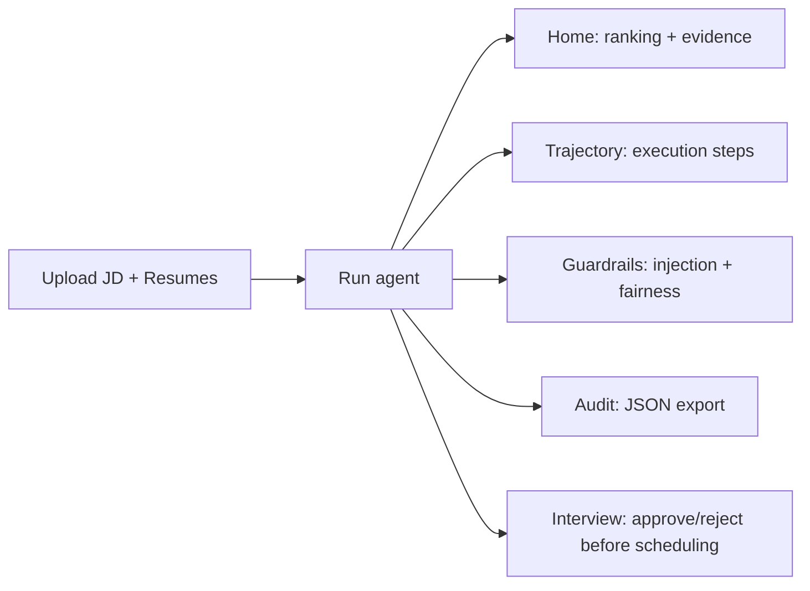

# AI Recruitment Engine

Dark-themed recruitment workflow built with **LangGraph** and the **OpenRouter Chat Completions API**. The application parses a job description (JD) and candidate resumes, generates an evidence-backed scoring rubric, applies guardrails and fairness auditing, and guides interview scheduling through an explicit **human approval gate**.

## Live UI (dark theme)

The repository includes a Streamlit dashboard with a premium dark SaaS look and the following tabs:

- **Home**: candidate ranking, metric cards, and per-candidate expandable details (score, weighted criteria, evidence, decision).
- **Trajectory**: step-by-step execution trajectory from the LangGraph pipeline.
- **Guardrails**: prompt-injection detection log, fairness audit results, and guardrail/compliance summary.
- **Audit**: decisions table, tool-call summary, and JSON export.
- **Interview**: shortlist queue with slot selection and explicit **approve/reject** controls before scheduling.

## Architecture

### LangGraph pipeline

```mermaid
flowchart TD
  A[parse_jd] --> B[generate_rubric]
  B --> C[create_plan]
  C --> D[parse_resume]
  D --> E[score_candidate]
  E --> F[make_decision]
  F --> G[guardrail_check]

  G -- SHORTLIST --> H[check_availability]
  G -- not SHORTLIST --> Z[END]
  H --> I[schedule_interview (interrupt_before)]
  I --> Z[END]
```

Key pipeline behavior:
- **Conditional scheduling**: scheduling only proceeds when the LLM decision is **SHORTLIST**.
- **Human-in-the-loop scheduling gate**: the graph compilation uses `interrupt_before=["schedule_interview"]`, and the Streamlit app requires explicit approval before allowing scheduling.

### Data flow inside the UI



## Features (based on current implementation)

- **JD parsing**: converts raw JD text into a structured `JobDescription`.
- **Rubric generation**: generates a weighted hiring rubric from the parsed JD.
- **Resume parsing with injection detection logging**:
  - checks resume text for prompt-injection patterns using `tools/sanitizer.py`.
  - records an injection log in the graph state.
- **Evidence-enforced scoring**:
  - criteria with missing/empty evidence are assigned score **0** and evidence is replaced with a sentinel message.
  - recalculates `total_score` accordingly.
- **LLM decision engine**: produces a `FinalDecision` for each candidate.
- **Guardrail check**: runs a guardrail prompt against the decision output.
- **Fairness audit**: runs an audit across all candidates using `tools/fairness_auditor.py`.
- **Interview scheduling with explicit human approval**:
  - shortlisted candidates appear in the **Interview** tab.
  - the app requires recruiter approval before calling the scheduling tool.

## Tech Stack

- **Python**
- **LangGraph**: stateful orchestration and conditional edges
- **OpenRouter API**: `https://openrouter.ai/api/v1/chat/completions` (hardcoded in `ai_recruitment_engine/app.py`)
- **Streamlit**: dark-themed dashboard UI
- **Pydantic**: data schemas for JD/resume/decisions/scores
- **PyPDF2**: PDF text extraction
- **Requests / python-dotenv**: API calls and environment configuration

## Project layout

Only the relevant project directory is described here:

```text
ai_recruitment_engine/
  app.py                     # OpenRouter API client
  streamlit_app.py          # Streamlit dashboard entrypoint
  requirements.txt
  .env                      # required: OPENROUTER_API_KEY and MODEL

  graph/
    graph.py                # LangGraph builder (interrupt_before schedule_interview)
    nodes.py                # node implementations
    state.py                # RecruitmentState definition

  prompts/
    *.py                    # prompt templates (JD, rubric, decision, guardrails, scheduling, etc.)

  tools/
    *.py                    # resume parsing, scoring, sanitizer, fairness auditing, availability, interview scheduling

  ui/
    components.py           # dark UI components used by streamlit_app
```

## Setup

### 1) Install dependencies

```bash
pip install -r ai_recruitment_engine/requirements.txt
```

### 2) Configure environment variables

Create `ai_recruitment_engine/.env`:

```text
OPENROUTER_API_KEY=YOUR_KEY_HERE
MODEL=openai/gpt-4o-mini
```

### 3) Run the dashboard

```bash
streamlit run ai_recruitment_engine/streamlit_app.py
```

## Usage

1. Upload a **Job Description** (`.txt` or `.pdf`).
2. Upload one or more **candidate resumes** (`.txt` or `.pdf`).
3. Click **Run Recruitment Agent**.
4. Review results in:
   - **Home** (ranking + evidence)
   - **Trajectory** (execution trace)
   - **Guardrails** and **Audit** (injection + fairness summaries)
5. Go to **Interview**:
   - shortlisted candidates are shown with an explicit **Approve/Reject** workflow.
   - interview scheduling proceeds only after approval.

## Notes on scoring

- The UI displays `total_score` from the candidate score card.
- The graph enforces evidence rules during scoring by zeroing criteria with missing evidence.


