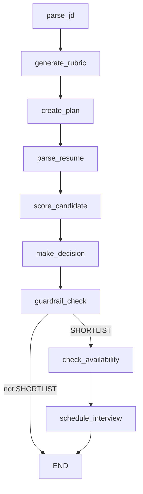
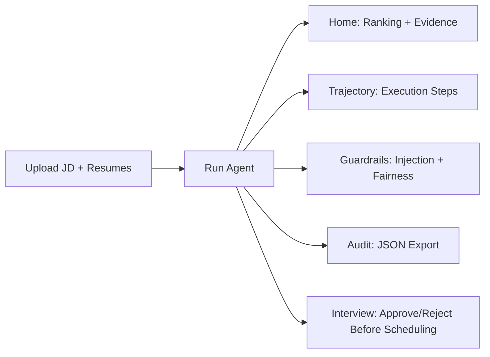

# AI Recruitment Engine

Dark-themed recruitment workflow built with **LangGraph** and the **OpenRouter Chat Completions API**. The application parses a job description (JD) and candidate resumes, generates an evidence-backed scoring rubric, applies guardrails and fairness auditing, and guides interview scheduling through an explicit **human approval gate**.

## Live UI (Dark Theme)

The repository includes a Streamlit dashboard with a premium dark SaaS-style interface and the following tabs:

- **Home**: Candidate ranking, metric cards, and per-candidate expandable details (score, weighted criteria, evidence, and decision).
- **Trajectory**: Step-by-step execution trajectory of the LangGraph pipeline.
- **Guardrails**: Prompt-injection detection logs, fairness audit results, and guardrail/compliance summary.
- **Audit**: Decisions table, tool-call summary, and JSON export.
- **Interview**: Shortlist queue with slot selection and explicit **Approve/Reject** controls before scheduling.

---

## Architecture

### LangGraph Pipeline



### Key Pipeline Behavior

- **Conditional scheduling**: Scheduling proceeds only when the LLM decision is **SHORTLIST**.
- **Human-in-the-loop scheduling gate**: The graph is compiled using `interrupt_before=["schedule_interview"]`, and the Streamlit application requires explicit recruiter approval before scheduling.

---

## Data Flow Inside the UI



---

## Features (Based on the Current Implementation)

- **JD Parsing**: Converts raw job description text into a structured `JobDescription`.
- **Rubric Generation**: Generates a weighted hiring rubric from the parsed JD.
- **Resume Parsing with Prompt-Injection Detection Logging**:
  - Checks resume text for prompt-injection patterns using `tools/sanitizer.py`.
  - Records an injection log in the graph state.
- **Evidence-Enforced Scoring**:
  - Criteria with missing or empty evidence are assigned a score of **0**, and the evidence is replaced with a sentinel message.
  - Recalculates `total_score` accordingly.
- **LLM Decision Engine**: Produces a `FinalDecision` for each candidate.
- **Guardrail Check**: Runs a guardrail prompt against the decision output.
- **Fairness Audit**: Audits all candidates using `tools/fairness_auditor.py`.
- **Interview Scheduling with Explicit Human Approval**:
  - Shortlisted candidates appear in the **Interview** tab.
  - The application requires recruiter approval before invoking the scheduling tool.

---

## Tech Stack

- **Python**
- **LangGraph**: Stateful orchestration and conditional graph execution
- **OpenRouter API**: Uses the Chat Completions endpoint (`https://openrouter.ai/api/v1/chat/completions`)
- **Streamlit**: Dark-themed dashboard UI
- **Pydantic**: Data schemas for JDs, resumes, scores, and decisions
- **PyPDF2**: PDF text extraction
- **Requests** and **python-dotenv**: API communication and environment configuration

---

## Project Layout

Only the relevant project directory is shown below:

```text
ai_recruitment_engine/
  app.py                     # OpenRouter API client
  streamlit_app.py           # Streamlit dashboard entry point
  requirements.txt
  .env                       # Required: OPENROUTER_API_KEY and MODEL

  graph/
    graph.py                 # LangGraph builder (interrupt_before schedule_interview)
    nodes.py                 # Node implementations
    state.py                 # RecruitmentState definition

  prompts/
    *.py                     # Prompt templates (JD, rubric, decision, guardrails, scheduling, etc.)

  tools/
    *.py                     # Resume parsing, scoring, sanitizer, fairness auditing, availability, interview scheduling

  ui/
    components.py            # Dark UI components used by streamlit_app
```

---

## Setup

### 1. Install Dependencies

```bash
pip install -r ai_recruitment_engine/requirements.txt
```

### 2. Configure Environment Variables

Create `ai_recruitment_engine/.env`:

```text
OPENROUTER_API_KEY=YOUR_KEY_HERE
MODEL=openai/gpt-4o-mini
```

### 3. Run the Dashboard

```bash
streamlit run ai_recruitment_engine/streamlit_app.py
```

---

## Usage

1. Upload a **Job Description** (`.txt` or `.pdf`).
2. Upload one or more **candidate resumes** (`.txt` or `.pdf`).
3. Click **Run Recruitment Agent**.
4. Review the results in:
   - **Home** (Ranking and evidence)
   - **Trajectory** (Execution trace)
   - **Guardrails** and **Audit** (Prompt-injection and fairness summaries)
5. Open the **Interview** tab:
   - Shortlisted candidates are displayed with an explicit **Approve/Reject** workflow.
   - Interview scheduling proceeds only after recruiter approval.

---

## Notes on Scoring

- The UI displays the `total_score` from each candidate's scorecard.
- During scoring, the graph enforces evidence requirements by assigning a score of **0** to any criterion with missing or empty evidence.
